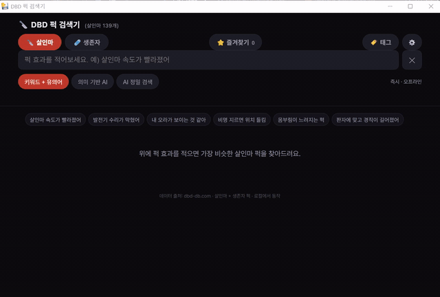

# 🔪 DBD 살인마 퍽 검색기

게임하면서 퍽 효과를 **한국어로 설명**하면, 가장 비슷한 **살인마 퍽**을
아이콘과 함께 가능성 높은 순으로 찾아줍니다.

> 예) `"살인마 속도가 빨라졌어"` → 이동 속도 관련 퍽들
> 예) `"발전기 수리가 막혔어"` → 교착 상태, 주술: 파멸 …

데이터 출처: [dbd-db.com](https://dbd-db.com/ko/perks) · 살인마 퍽 **139개** 전부

---

## 데모



> GIF 미리보기입니다. 소리·고화질 원본은 [assets/demo.mp4](assets/demo.mp4) 에서 볼 수 있어요.
> (GitHub README는 상대경로 `<video>` 재생을 지원하지 않아 GIF로 표시합니다.)

---

## 실행 방법

### 1) 가장 쉬운 방법 — `run.bat` 더블클릭 (권장)
로컬 서버를 띄우고 브라우저를 엽니다. **세 가지 검색 모드 모두 안정적으로 동작**합니다.
(파이썬 필요. 끝낼 땐 콘솔 창을 닫으면 됩니다.)

### 2) 그냥 `index.html` 더블클릭
**키워드 검색 모드**는 인터넷 없이 바로 동작합니다.
단, **의미 기반 AI**와 **AI 정밀 검색** 모드는 `run.bat`(로컬 서버) 방식이 필요합니다.

---

## 검색 모드 세 가지 (상단 버튼으로 전환)

| 모드 | 설명 | 특징 |
|------|------|------|
| **키워드 + 유의어** | "속도=이동속도=질주=무빙" 같은 게임 용어 사전으로 매칭 | 즉시 · 완전 오프라인 · 비용 0 |
| **의미 기반 AI** | 로컬 다국어 임베딩 모델로 문장 의미를 비교 | 모호한 표현에 강함 · **완전 오프라인**(모델 1회 다운로드 후) · 비용 0 |
| **AI 정밀 검색** | 살인마 퍽 **전체를 LLM에 보내** 가장 가능성 높은 퍽을 근거와 함께 반환 | 가장 정확 · API 키 필요 · 질문당 소액 과금 · Enter로 실행 |

- **키워드 모드**는 `발전기`, `갈고리`, `오라`, `판자` 처럼 구체적 단어가 들어간 질문에 특히 정확합니다.
- **의미 기반 AI**는 `"맞으면 한 방에 쓰러져"` 처럼 돌려 말해도 의미로 찾아줍니다. 모델·라이브러리를 **로컬에 받아두고**(`python download_model.py`, 1회) 브라우저 안에서 돌리므로, 그 뒤로는 **인터넷 없이** 동작하고 매번 다시 받지 않습니다.

  ```bash
  python download_model.py   # 1회: 모델(ONNX)+라이브러리를 models/, vendor/ 에 저장 (~155MB)
  ```
- **AI 정밀 검색**은 가장 똑똑합니다. 퍽 139개를 통째로 LLM에 넣고(프롬프트 캐싱으로 저렴), `confidence %`와 **매칭 근거**까지 보여줍니다.

### AI 정밀 검색 모드 설정 (API 키)

이 모드는 **Anthropic 또는 OpenAI** 중 하나의 API 키가 필요합니다. 드롭다운에서 모델을 고르면 해당 공급자 키를 사용합니다.

| 공급자 | 드롭다운 모델 | 필요한 환경변수 | 키 발급 |
|--------|--------------|----------------|---------|
| **Anthropic** | Opus 4.8 (정확) · Haiku 4.5 (빠름) | `ANTHROPIC_API_KEY` | [console.anthropic.com](https://console.anthropic.com/) |
| **OpenAI** | GPT-4.1 · GPT-4.1 mini · GPT-4o · GPT-4o mini | `OPENAI_API_KEY` | [platform.openai.com](https://platform.openai.com/api-keys) |

PC 환경변수로 한 번만 설정하면 됩니다 (쓰려는 공급자 키만 있으면 됨).
아래에서 `여기에_본인_키_붙여넣기` 부분을 **본인의 실제 API 키로 바꿔서** 실행하세요:

```bat
setx ANTHROPIC_API_KEY "여기에_본인_키_붙여넣기"
REM 또는
setx OPENAI_API_KEY "여기에_본인_키_붙여넣기"
```

> ⚠️ 위 명령을 **그대로(자리표시자 채로) 실행하지 마세요.** 따옴표 안 문자열이 그대로 환경변수 값이 되어 기존 키를 덮어씁니다. 반드시 실제 키(`sk-ant-...` / `sk-proj-...`)로 바꿔 넣으세요.

설정 후 **새 콘솔 창**에서 `run.bat`을 다시 실행하세요. 키는 로컬 서버(`server.py`)에서만 읽으며, **브라우저로 노출되지 않습니다.** `run.bat` 자체는 환경변수를 변경하지 않습니다.
(키가 없어도 키워드/의미기반 모드는 정상 동작합니다.)

키를 잘못 덮어썼다면 같은 `setx`로 실제 키를 다시 넣거나, 아예 지우려면:
```bat
reg delete "HKCU\Environment" /v OPENAI_API_KEY /f
```
실행 후 새 콘솔 창을 열면 적용됩니다.

> 모델 목록을 바꾸려면 `index.html`의 `<select id="model">`과 `server.py`의 `ALLOWED_MODELS`를 함께 수정하세요. `claude-`로 시작하면 Anthropic, 그 외는 OpenAI로 라우팅됩니다.

---

## 유의어 사전 직접 늘리기

게임 용어/줄임말이 부족하면 [synonyms.js](synonyms.js) 를 편집하세요.
같은 개념의 말들을 한 줄(배열)로 묶으면, 그중 아무 단어로 검색해도 그룹 전체로 매칭됩니다.

```js
// 한 줄 = 한 그룹
["이동 속도", "속도", "빨라", "질주", "무빙", "이속", ...],
```

---

## 데이터 갱신 (새 퍽 추가 시)

```bash
python build_data.py
```

dbd-db.com 에서 살인마 퍽 목록·한글 설명문을 다시 받아
`perks.json`, `perks_data.js` 를 갱신하고 `icons/` 에 아이콘을 내려받습니다.

---

## 파일 구성

| 파일 | 역할 |
|------|------|
| `index.html` | 검색 앱 (UI + 세 가지 검색 모드) |
| `search.js` | 키워드 + 유의어 검색·랭킹 로직 |
| `synonyms.js` | DBD 한글 게임 용어 유의어 사전 (편집 가능) |
| `server.py` | 로컬 서버 — 정적 파일 제공 + `/ask`(LLM 정밀 검색, Anthropic/OpenAI 라우팅, 프롬프트 캐싱) |
| `perks_data.js` | 퍽 데이터 (앱이 직접 읽음, 자동 생성) |
| `perks.json` | 퍽 데이터 원본 (서버·빌드가 사용, 자동 생성) |
| `icons/` | 살인마 퍽 아이콘 139개 (오프라인용) |
| `build_data.py` | 데이터 수집·갱신 스크립트 |
| `download_model.py` | 의미기반 AI용 모델·라이브러리 1회 다운로드 (→ `models/`, `vendor/`) |
| `models/`, `vendor/` | 로컬 임베딩 모델(ONNX) + transformers.js·wasm (자동 생성, 오프라인용) |
| `assets/demo.gif` · `assets/demo.mp4` | 실행 데모 (README용 GIF + 원본 영상) |
| `run.bat` | 실행기 (SDK 자동 설치 + 서버 기동 + 브라우저 열기) |
